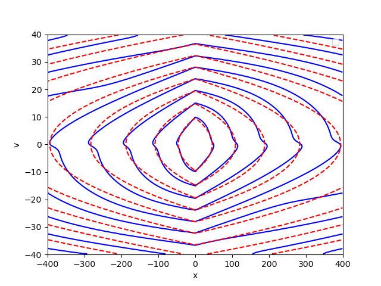
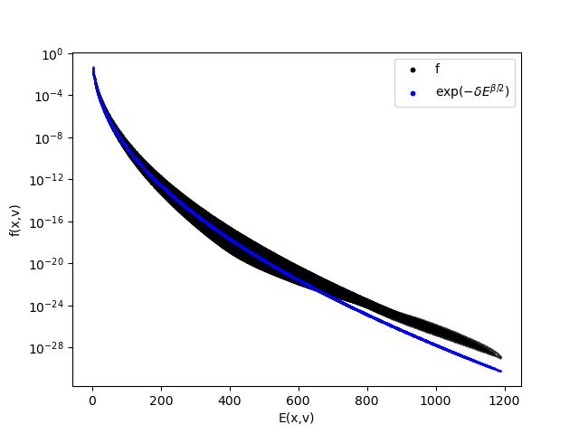
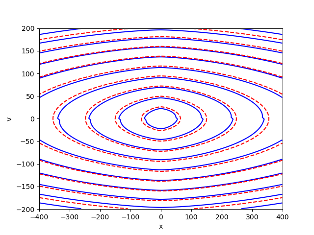
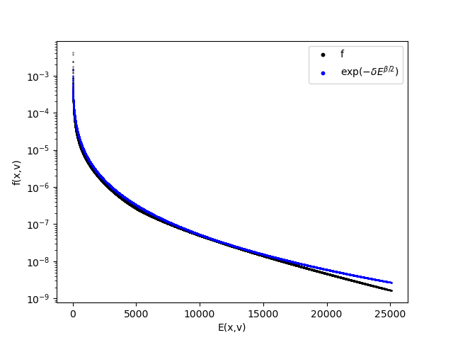

# Numerical Scheme for the Kinetic Fokker-Planck Equation (1D)

This project develops and implements a **numerical scheme** for the **kinetic Fokker-Planck equation** in one spatial and one velocity dimension. The equation has the general form

$$ \partial_t f=\mathcal{L}f:=-v\cdot\nabla_x f+\nabla_x V\cdot \nabla_v f+\nabla_v\cdot \left(\mathcal{M}\nabla_v\left(\frac{f}{\mathcal{M}}\right)\right), $$

where:
- The **transport operator** corresponds to a **classical Hamiltonian vector field** with external potential $V(x)$,
- The **collision operator** is a **Fokker-Planck operator in velocity**.

We consider potentials $V=V(x)$ and local equilibria $\mathcal{M}=\mathcal{M}(v)$ of the form

$$ V(x) = \frac{\lfloor x \rceil ^\alpha}{\alpha} \qquad\qquad \mathcal{M}(v) = \exp( -\frac{\lfloor v \rceil ^\beta}{\beta} )$$

where $\lfloor x \rceil^2 =1+|x|^2$ and $\alpha>1$, $\beta>0$.

The reference paper is [arxiv:2510.12331](https://arxiv.org/pdf/2510.12331).

---

## Domain and Boundary Conditions

- The computation is performed on a **very large domain** in both **space** $x$ and **velocity** $v$.
- The numerical scheme is taken from [A. Borzì, S. Roy, Numerical approximation of kinetic Fokker-Planck equations with specular reflection boundary conditions](https://www.sciencedirect.com/science/article/pii/S0021999124000901) 
- **Specular boundary conditions in space** and **zero-flux boundary conditions in velocity** are imposed at the boundaries of the computational box.

---

## How it works

- **Entry point:** Open the file `main.py`. Specify the choice of paramters. Set `CONTINUE = False` to start a new simulation OR set `CONTINUE = True` and the last time `T_old` to resume/continue a previous simulation.
- **Computations:** The script `main.py` will initialise the simulation in `KineticFokkerPlanck.py` and it will execute it with the specified parameters 
- **Results:** You will find the diagnostic files .pkl in the folder specified in `main.py`.
- **Analysis of data:** In the file `Notebook.py` you will find some functions to analyse the results.

---

## Results about the steady state G

	<table>
		<tr>
			<td></td>
			<td></td>
		</tr>
		<tr>
			<td colspan="2" align="center"><em>Steady state G for $\alpha=1$, $\beta=1$. **Left:** level sets of G compared with level sets of the Energy. **Right:** Decay of the steady state G along the energy and comparison with the expected profile.</em></td>
		</tr>
	</table>

	<table>
		<tr>
			<td></td>
			<td></td>
		</tr>
		<tr>
			<td colspan="2" align="center"><em>Steady state G for $\alpha=1$, $\beta=1$. **Left:** level sets of G compared with level sets of the Energy. **Right:** Decay of the steady state G along the energy and comparison with the expected profile.</em></td>
		</tr>
	</table>

## Features

- **Positivity-preserving**
- **Mass-preserving**
- Stability under **CFL conditions**

---

## Possible Future Directions

- Extension to higher-dimensional problems (2D).

---

